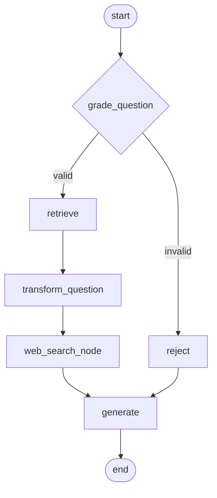
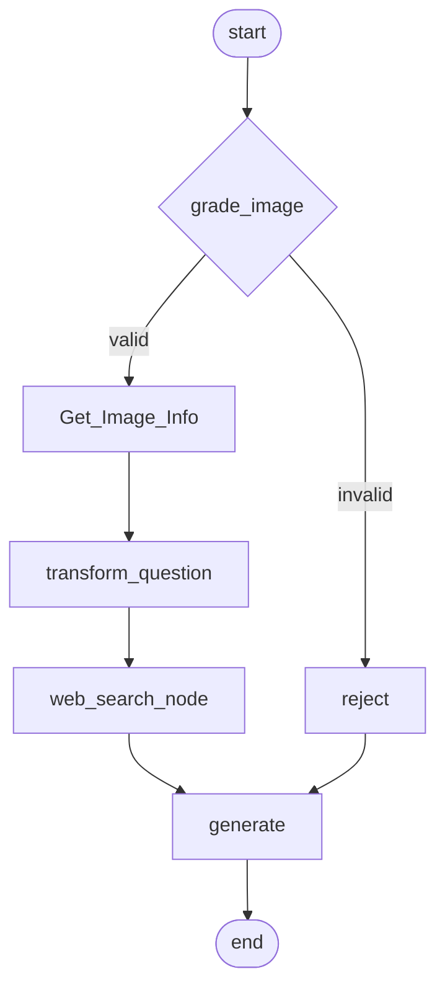

# 🧠 MedQueryAI: Advanced Medical Knowledge Assistant

MedQueryAI is a multi-modal medical AI system designed to deliver accurate and insightful responses to both text-based and image-based medical queries. By combining Retrieval-Augmented Generation (RAG), Hugging Face embeddings, Pinecone vector search, Tavily web search, and Google Gemini 2.5 Flash, MedQueryAI offers robust, context-aware responses for healthcare applications.

## 🔧 Features

- Multi-modal support for text and image queries
- RAG-based architecture with internal and external context retrieval
- Integration with Google Gemini 2.5 Flash for medical reasoning and generation
- Real-time web augmentation using Tavily Search API
- Image understanding via a custom `Get_Image_Info` pipeline
- Scalable deployment using FastAPI, Docker, and GitHub Actions

## 🧠 How It Works

1. **Grading Phase**:
   - Text queries pass through `grade_question`
   - Image inputs go through `grade_image`
   - Invalid or low-quality inputs are filtered via the `reject` node

2. **Retrieval Phase**:
   - Valid inputs are routed to either:
     - `retrieve` node for semantic vector search using Hugging Face and Pinecone (text)
     - `Get_Image_Info` node for extracting clinical features from image input

3. **Transformation Phase**:
   - Questions are reformatted using `transform_question` to match the prompt expectations of the LLM

4. **Web Search Phase**:
   - A `web_search_node` integrates external medical knowledge using the Tavily toolkit

5. **Generation Phase**:
   - A context-rich response is generated using Google Gemini 2.5 Flash
   - The response is returned via the `generate` node

## 🧭 Workflow Diagrams

### 🔤 Text-Only Query Pipeline



### 🖼️ Image + Text Query Pipeline




## 📂 Project Structure

```plaintext
MedQueryAI/
├── app.py
├── static/
│   ├── script.js               
│   └── style.css
├── templates/
│   └── index.html
├── research/
│   ├── trial_image.ipynb             # Prototyping code for Image
│   └── trial_text.ipynb              # Prototyping code for text
├── src/
│   ├── helper_text.py                # text-analysis workflow code
│   └── helper_image.py               # image+text analysis workflow code
├── Dockerfile
├── requirements.txt
├── .github/
│   └── workflows/
│       └── cicd.yaml                 # GitHub Actions configs
├── .env
├── .gitignore                   
├── .dockerignore
├── store.py                          # Used to create pinecone index
└── README.md
```


## 🚀 Deployment Guide

### ✅ Local Development

To run the project locally:

1. **Clone the repository**
   ```bash
   git clone https://github.com/yourusername/MedQueryAI.git
   cd MedQueryAI
   ```

2. **Install dependencies**
   ```bash
   pip install -r requirements.txt
   ```

3. **Set up environment variables**

   Create a `.env` file in the root directory with the following:
   ```env
   PINECONE_API_KEY=your_pinecone_api_key
   TAVILY_API_KEY=your_tavily_api_key
   GEMINI_API_KEY=your_gemini_api_key
   ```

4. **Start the FastAPI server**
   ```bash
   uvicorn app.main:app --reload
   ```

5. **Open in browser**
   - App URL: http://localhost:8080

---

### 🐳 Docker Deployment

1. **Build the Docker image**
   ```bash
   docker build -t medqueryai .
   ```

2. **Run the Docker container**
   ```bash
   docker run -p 8888:8080 abhishekraj07/medqueryai
   ```

> ✅ Ensure your `.env` file is present in the root directory before running the container.

---

### ⚙️ CI/CD with GitHub Actions

This project uses GitHub Actions for automated testing and deployment.

1. **Workflow file**
   ```
   .github/workflows/cicd.yaml
   ```

2. **Pipeline includes:**
   - Checkout source code
   - Set up Python environment
   - Install dependencies
   - Build and push Docker image (if configured)
   - Deploy to cloud (e.g., AWS EC2/ECS)

3. **Secrets to set in GitHub**
   Go to: **Repository > Settings > Secrets and variables > Actions**, and add:
   - `AWS_ACCESS_KEY_ID`
   - `AWS_SECRET_ACCESS_KEY`
   - `PINECONE_API_KEY`
   - `TAVILY_API_KEY`
   - `GEMINI_API_KEY`
   - `ECR_REPO`

4. **Triggering**
   - Automatically on `push` to `main`
   - Or manually via GitHub → Actions → Run workflow a
